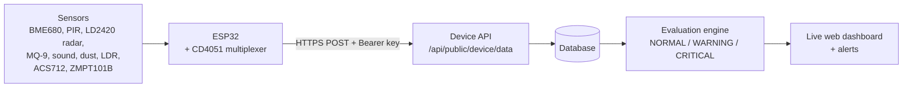

# VitalLume: The Invisible Home Guardian

**A privacy-preserving ambient home safety and health-monitoring system that lives in an ordinary light socket.**
No wearables. No cameras. Whole-room awareness.


> Final-year engineering project, SKN Sinhgad College of Engineering, Korti, Pandharpur (2026–2027).

**Live dashboard:** https://vital-lume.lovable.app

---

## Table of Contents

1. [The Problem](#the-problem)
2. [Our Solution](#our-solution)
3. [Key Features](#key-features)
4. [System Architecture](#system-architecture)
5. [Hardware](#hardware)
6. [Web Dashboard](#web-dashboard)
7. [Device API](#device-api)
8. [Firmware Setup](#firmware-setup)
9. [Project Status and Roadmap](#project-status-and-roadmap)
10. [Security Notes](#security-notes)
11. [Team](#team)
12. [License](#license)

---

## The Problem

People living alone, especially elderly family members, are at risk from events that go unnoticed for hours: a fall, a gas leak, poor air quality, or unusual inactivity. Wearables get forgotten or left uncharged, and cameras raise serious privacy concerns at home.

## Our Solution

VitalLume turns a normal ceiling light socket into a passive, always-on sensing node. It combines environmental, motion, presence, and electrical sensors to understand what is happening in a room **without recording video or audio content** and without asking anyone to wear anything.

When something looks wrong, such as a possible fall, dangerous gas levels, or an abnormal environment, VitalLume classifies the situation and raises an alert that a caregiver can see immediately on the dashboard.

## Key Features

- **Live monitoring dashboard** with plain-language reading cards, designed to be understood at a glance by non-technical family members and caregivers (no complicated charts).
- **Three-level status engine:** `NORMAL`, `WARNING`, and `CRITICAL`, based on combined sensor readings rather than a single threshold.
- **Multi-sensor fusion:** sound, motion, presence, gas, and environmental data are evaluated together to reduce false alarms.
- **Alerts panel** with severity, a plain-language explanation of what triggered each alert, and acknowledgement.
- **Caregiver dispatch view** with an incident trace for critical events.
- **Emergency simulator** to demonstrate fall and gas-leak scenarios without needing real hardware.
- **Device heartbeat:** the dashboard shows whether the device is online or offline.
- **Privacy by design:** no cameras, no wearables, no health-diagnosis claims. VitalLume is an awareness and alerting tool, not a medical device.

## System Architecture



1. The ESP32 reads every sensor and packages the readings as JSON.
2. It sends the data over Wi-Fi via an authenticated HTTPS POST every ~3 seconds.
3. The backend stores each reading, evaluates it, and creates alerts when needed.
4. The dashboard displays the latest readings, device status, and alerts.

## Hardware

### Bill of Materials

| # | Component | Purpose |
|---|---|---|
| 1 | ESP32 dev board | Main controller with Wi-Fi |
| 2 | BME680 | Temperature, humidity, pressure |
| 3 | PIR HC-SR501 | Motion detection |
| 4 | HLK-LD2420 24 GHz radar | Presence, including stationary people |
| 5 | MQ-9 | Carbon monoxide, methane, LPG |
| 6 | LM393 sound sensor | Sound level |
| 7 | Analog microphone module | Second sound reading |
| 8 | GP2Y1010AU0F | PM2.5 dust and smoke |
| 9 | LDR module | Ambient light |
| 10 | ACS712 (30 A) | Current sensing |
| 11 | ZMPT101B | AC voltage sensing |
| 12 | CD4051 analog multiplexer | Shares one ADC pin across three sensors |
| 13 | Breadboard, jumper wires, RC filter (150 Ω + 220 µF) | Prototyping |

### Pin Map

| Sensor | Signal | ESP32 pin |
|---|---|---|
| PIR HC-SR501 | OUT | GPIO 27 |
| LM393 sound | AO | GPIO 26 |
| Analog microphone | AO | GPIO 35 |
| MQ-9 gas | AO | GPIO 32 |
| GP2Y1010 dust | VO | GPIO 33 |
| GP2Y1010 dust | LED control | GPIO 4 |
| LD2420 radar | OT2 (presence) | GPIO 25 |
| BME680 | SDA / SCL | GPIO 21 / GPIO 22 |
| CD4051 | Select A / B / C | GPIO 16 / GPIO 17 / GPIO 5 |
| CD4051 | Common signal (SIG) | GPIO 34 |

**CD4051 channels:** ACS712 current → CH2, LDR → CH3, ZMPT101B voltage → CH4.

> **Note:** GPIO 26 belongs to the ESP32's ADC2, which can become unreliable while Wi-Fi is active. If the LM393 readings look erratic once the device is online, move that sensor to an ADC1 pin.

## Web Dashboard

The dashboard uses a light, friendly, card-based design and shows:

- Current temperature, humidity, pressure, air quality (gas), sound, motion, and presence
- Device status (online / offline) and the current `NORMAL` / `WARNING` / `CRITICAL` classification
- Active and past alerts with acknowledgement
- The emergency simulator and caregiver dispatch view

Respiration rate and heart-rate monitoring are intentionally **not** included, because the hardware does not measure them.

## Device API

**Endpoint**

```
POST https://vital-lume.lovable.app/api/public/device/data
Authorization: Bearer <YOUR_DEVICE_KEY>
Content-Type: application/json
```

**Example payload**

```json
{
  "deviceId": "vitallume-001",
  "temperature": 22.4,
  "humidity": 46,
  "pressure": 1012,
  "gas": 60,
  "sound": 38,
  "motion": true,
  "presence": true
}
```

The firmware also sends `soundMic`, `dust`, `current`, `voltage`, and `light`. See the [roadmap](#project-status-and-roadmap) for their dashboard status.

A successful request returns HTTP `200`, and the reading appears on the dashboard within a few seconds.

## Firmware Setup

1. Install the [Arduino IDE](https://www.arduino.cc/en/software).
2. Add the ESP32 board package: install **esp32 by Espressif Systems** from *Tools → Board → Boards Manager*, then select **ESP32 Dev Module** (or the closest match for your board).
3. Install these libraries from the Library Manager:
   - `ArduinoJson`
   - `Adafruit BME680 Library`
   - `Adafruit Unified Sensor`
4. Open `firmware/vitallume_esp32_final.ino` and set:
   ```cpp
   const char* WIFI_SSID       = "YOUR_WIFI_NAME";
   const char* WIFI_PASSWORD   = "YOUR_WIFI_PASSWORD";
   const char* DEVICE_API_KEY  = "YOUR_DEVICE_KEY";
   ```
5. Wire the sensors according to the [pin map](#pin-map).
6. Upload the sketch, then open the Serial Monitor at **115200 baud**.
7. You should see `WiFi connected` followed by `POST -> 200` roughly every 3 seconds. The dashboard will then show the device as online.

### Calibration

Several conversions in the firmware are marked `TODO` and use placeholder formulas: MQ-9 gas (ppm), dust density, sound (dB), ACS712 current, and ZMPT101B voltage. Calibrate each against a known reference before relying on absolute values.

## Project Status and Roadmap

- [x] Sensor node firmware (ESP32, multiplexer, all sensors)
- [x] Authenticated device API and live dashboard
- [x] Hardware verified with a live Blynk dashboard
- [ ] Dashboard cards for dust, current, voltage, and light
- [ ] Per-sensor calibration
- [ ] Push and SMS notifications for critical alerts
- [ ] Enclosure that fits a standard light socket

## Security Notes

- **Never commit real device keys or Wi-Fi passwords.** Keep them in a local, git-ignored header (for example `secrets.h`) or paste them only into your local copy.
- The firmware skips TLS certificate validation (`setInsecure()`) for prototyping simplicity. Use a proper root certificate for any production deployment.
- VitalLume is a prototype safety-awareness tool and **not a certified medical or life-safety device**.

## Team

| Name | Role |
|---|---|
| _Srushti Mote_ | _Hardware / firmware_ |
| _Bhakti Mane_ | _Web dashboard_ |
| _Sakshi Mane_Nikita_Kumbhar_ | _Documentation and testing_ |

**Guide / Institution:** SKN Sinhgad College of Engineering, Korti, Pandharpur

